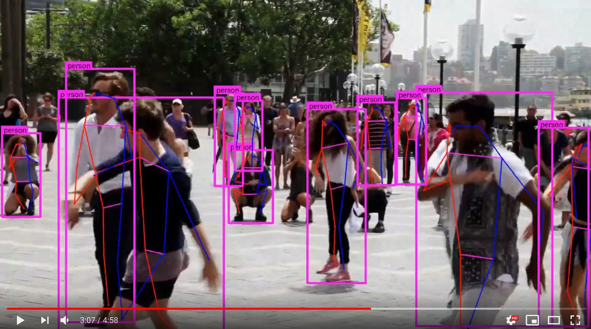

# Human pose estimation on an image
```
    PYTHONPATH=. python keras_centernet/bin/hpdet_image.py --fn assets/hp_demo.jpg --inres 512,512
```
<p align="center"> 
  
</p>

# Human pose estimation on a video
```
    mkdir -p output && youtube-dl  -f 137 https://www.youtube.com/watch?v=2DiQUX11YaY --output output/sydney.mp4

    PYTHONPATH=. python keras_centernet/bin/hpdet_video.py --inres 512,512 --video output/sydney.mp4
```
You should get the following output:

<p align="center"> 
  <a href="https://youtu.be/6dZQ1oMq8uc">
    
  </a>
</p>

# Reproducing COCO AP scores for human pose estimation

## Get the data
```
wget images.cocodataset.org/zips/val2017.zip
unzip val2017.zip && rm val2017.zip
wget images.cocodataset.org/annotations/annotations_trainval2017.zip
unzip annotations_trainval2017.zip && rm annotations_trainval2017.zip
```

## COCO Evaluation results


* Fixed resolution 512,512: 780s -> 156ms/image
```
PYTHONPATH=. python keras_centernet/bin/hpdet_coco.py --data val2017 --annotations annotations  --inres 512,512 --no-full-resolution
 Average Precision  (AP) @[ IoU=0.50:0.95 | area=   all | maxDets= 20 ] = 0.590
 Average Precision  (AP) @[ IoU=0.50      | area=   all | maxDets= 20 ] = 0.825
 Average Precision  (AP) @[ IoU=0.75      | area=   all | maxDets= 20 ] = 0.637
 Average Precision  (AP) @[ IoU=0.50:0.95 | area=medium | maxDets= 20 ] = 0.521
 Average Precision  (AP) @[ IoU=0.50:0.95 | area= large | maxDets= 20 ] = 0.709
 Average Recall     (AR) @[ IoU=0.50:0.95 | area=   all | maxDets= 20 ] = 0.662
 Average Recall     (AR) @[ IoU=0.50      | area=   all | maxDets= 20 ] = 0.872
 Average Recall     (AR) @[ IoU=0.75      | area=   all | maxDets= 20 ] = 0.709
 Average Recall     (AR) @[ IoU=0.50:0.95 | area=medium | maxDets= 20 ] = 0.573
 Average Recall     (AR) @[ IoU=0.50:0.95 | area= large | maxDets= 20 ] = 0.788
```

* Full resolution, `mode='testing'`: 914s -> 183ms/image
```
PYTHONPATH=. python keras_centernet/bin/hpdet_coco.py --data val2017 --annotations annotations
 Average Precision  (AP) @[ IoU=0.50:0.95 | area=   all | maxDets= 20 ] = 0.618
 Average Precision  (AP) @[ IoU=0.50      | area=   all | maxDets= 20 ] = 0.842
 Average Precision  (AP) @[ IoU=0.75      | area=   all | maxDets= 20 ] = 0.678
 Average Precision  (AP) @[ IoU=0.50:0.95 | area=medium | maxDets= 20 ] = 0.573
 Average Precision  (AP) @[ IoU=0.50:0.95 | area= large | maxDets= 20 ] = 0.701
 Average Recall     (AR) @[ IoU=0.50:0.95 | area=   all | maxDets= 20 ] = 0.695
 Average Recall     (AR) @[ IoU=0.50      | area=   all | maxDets= 20 ] = 0.890
 Average Recall     (AR) @[ IoU=0.75      | area=   all | maxDets= 20 ] = 0.753
 Average Recall     (AR) @[ IoU=0.50:0.95 | area=medium | maxDets= 20 ] = 0.627
 Average Recall     (AR) @[ IoU=0.50:0.95 | area= large | maxDets= 20 ] = 0.791
```

* Pytorch (official repository), same as `--keep_res`: 453s -> 91ms/image
```
Evaluate annotation type *keypoints*
 Average Precision  (AP) @[ IoU=0.50:0.95 | area=   all | maxDets= 20 ] = 0.619
 Average Precision  (AP) @[ IoU=0.50      | area=   all | maxDets= 20 ] = 0.842
 Average Precision  (AP) @[ IoU=0.75      | area=   all | maxDets= 20 ] = 0.681
 Average Precision  (AP) @[ IoU=0.50:0.95 | area=medium | maxDets= 20 ] = 0.575
 Average Precision  (AP) @[ IoU=0.50:0.95 | area= large | maxDets= 20 ] = 0.701
 Average Recall     (AR) @[ IoU=0.50:0.95 | area=   all | maxDets= 20 ] = 0.696
 Average Recall     (AR) @[ IoU=0.50      | area=   all | maxDets= 20 ] = 0.890
 Average Recall     (AR) @[ IoU=0.75      | area=   all | maxDets= 20 ] = 0.755
 Average Recall     (AR) @[ IoU=0.50:0.95 | area=medium | maxDets= 20 ] = 0.628
 Average Recall     (AR) @[ IoU=0.50:0.95 | area= large | maxDets= 20 ] = 0.791
```

* Pytorch (official repository), same as `--keep_res --flip_test`: 827s -> 165ms/image
```
Evaluate annotation type *keypoints*
 Average Precision  (AP) @[ IoU=0.50:0.95 | area=   all | maxDets= 20 ] = 0.640
 Average Precision  (AP) @[ IoU=0.50      | area=   all | maxDets= 20 ] = 0.856
 Average Precision  (AP) @[ IoU=0.75      | area=   all | maxDets= 20 ] = 0.702
 Average Precision  (AP) @[ IoU=0.50:0.95 | area=medium | maxDets= 20 ] = 0.594
 Average Precision  (AP) @[ IoU=0.50:0.95 | area= large | maxDets= 20 ] = 0.721
 Average Recall     (AR) @[ IoU=0.50:0.95 | area=   all | maxDets= 20 ] = 0.709
 Average Recall     (AR) @[ IoU=0.50      | area=   all | maxDets= 20 ] = 0.901
 Average Recall     (AR) @[ IoU=0.75      | area=   all | maxDets= 20 ] = 0.767
 Average Recall     (AR) @[ IoU=0.50:0.95 | area=medium | maxDets= 20 ] = 0.644
 Average Recall     (AR) @[ IoU=0.50:0.95 | area= large | maxDets= 20 ] = 0.802
```

