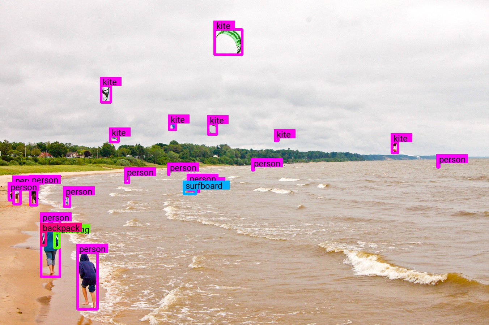
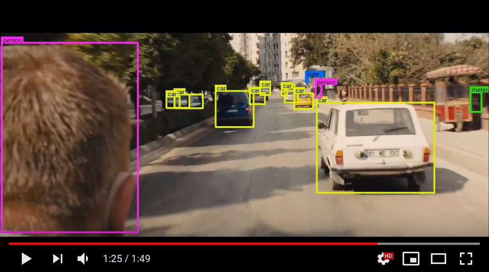

# Keras-CenterNet

Keras port of CenterNet (https://arxiv.org/abs/1904.07850)

### Abstract
Detection identifies objects as axis-aligned boxes in an image. Most successful object detectors enumerate a nearly exhaustive list of potential object locations and classify each. This is wasteful, inefficient, and requires additional post-processing. In this paper, we take a different approach. We model an object as a single point -- the center point of its bounding box. Our detector uses keypoint estimation to find center points and regresses to all other object properties, such as size, 3D location, orientation, and even pose. Our center point based approach, CenterNet, is end-to-end differentiable, simpler, faster, and more accurate than corresponding bounding box based detectors. CenterNet achieves the best speed-accuracy trade-off on the MS COCO dataset, with 28.1% AP at 142 FPS, 37.4% AP at 52 FPS, and 45.1% AP with multi-scale testing at 1.4 FPS. We use the same approach to estimate 3D bounding box in the KITTI benchmark and human pose on the COCO keypoint dataset. Our method performs competitively with sophisticated multi-stage methods and runs in real-time.
<p align="center"> 
  
</p>

## Overview

> One-sentence method summary: use keypoint detection technic to detect the bounding box center point and regress to all other object properties like bounding box size, 3d information, and pose


CenterNet is a meta-algorithm for all kind of object detection related tasks. The offical code solves 2D detection, 3D detection and human pose estimation. Instead of commonly used anchor boxes, objects are represented as points. CenterNet also removes many hyperparameters and concepts that were required for previous single shot detectors:
- No more anchor boxes
- Just one feature map that represents all scales
- No bounding box matching
- No non maximum suppression

Right now, this repository supports 2D object detection and human pose estimation. Hopefully, 3D object detection will be added soon.


## Quick Start

### Installing dependencies

1. Install Python 3.

2. Install [TensorFlow](https://www.tensorflow.org/install/) for your platform. For better performance, install with GPU support if it's available. This code works with TensorFlow 1.13.

3. Install the requirements:
    ```
    pip install -r requirements.txt
    ```
    Or start a docker container. Note that [nvidia-docker](https://github.com/NVIDIA/nvidia-docker) is required:
    ```
    docker build -t keras_centernet:latest -f Dockerfile .
    docker run --runtime=nvidia -v $PWD:/keras-centernet -w /keras-centernet -it --rm keras_centernet:latest
    ```

4. Run CenterNet on an image:
    ```
    PYTHONPATH=. python keras_centernet/bin/ctdet_image.py --fn assets/demo2.jpg --inres 512,512
    ```

    Or use a video as input. You can re-create the demo video like this:
    ```
    mkdir -p output && youtube-dl  -f 137 https://www.youtube.com/watch?v=tHRLX8jRjq8 --output output/skyfall.mp4
    PYTHONPATH=. python keras_centernet/bin/ctdet_video.py --inres 512,512 --video output/skyfall.mp4
    ```

    Refer to [COCO.md](https://github.com/see--/keras-centernet/blob/master/COCO.md) if you want to reproduce the 2D object detection results and to [POSE.md](https://github.com/see--/keras-centernet/blob/master/POSE.md) for human pose estimation.

## Demo Video
<p align="center"> 
  <a href="https://youtu.be/M63gSMdco2c">
    
  </a>
</p>


## Official PyTorch Implementation
- By Xingyi Zhou: https://github.com/xingyizhou/CenterNet

